# MIRA

**MIRA** 是一个面向通用竞品分析的多 Agent 市场情报研究系统，全称 **Market Intelligence Research Architecture**。

它会把用户的分析需求拆解成一条可观测的研究流水线：理解任务、发现竞品、规划信息源、搜索公开资料、抓取网页、抽取结构化画像、构建证据链、多维分析、质量审查，最后生成可读、可导出、带证据引用的竞品分析报告。

## 当前能力

- **两种任务输入模式**
  - 给定竞品：输入品类、至少两个竞品和补充说明。
  - AI 发现竞品：输入品类、竞品数量和补充说明，由 LLM 自动寻找合适竞品。
- **真实 API 驱动的 Multi-Agent 流程**
  - 当前默认 `SIMULATIVE = False`，会调用真实 LLM API 和搜索 API。
  - 可在 `backend/app/config.py` 中把 `SIMULATIVE` 改为 `True`，使用离线 fixture 进行流程演示。
- **最多 24 个 DAG 节点**
  - 深度审查启用时包含事实核查、引用检查、一致性检查、偏差检测和红队审查。
  - 深度审查关闭时会跳过审查分支，加快生成。
- **前端工作台**
  - 首页任务创建、历史记录、DAG 可视化、Agent 执行日志、证据库、知识库、观测面板、报告编辑和导出。
- **报告输出**
  - Markdown、HTML、JSON、PPT 大纲。
  - 引用会转换成可读证据标签，下载文件名也会根据任务主题生成。
- **可观测性**
  - 每个 Agent 的输入、输出、耗时、工具调用、token 使用量和错误信息都会记录在前端。

## 系统架构

```mermaid
flowchart LR
  User[用户任务] --> Intent[IntentAgent]
  Intent --> Planner[PlannerAgent]
  Planner --> Discovery[CompetitorDiscoveryAgent]
  Discovery --> SourcePlanning[SourcePlanningAgent]
  SourcePlanning --> Search[WebSearchAgent]
  Search --> Crawl[WebCrawlerAgent]
  Crawl --> Schema[SchemaExtractionAgent]
  Schema --> Evidence[EvidenceBuilderAgent]
  Evidence --> Specialists[多维分析 Agent]
  Specialists --> Analysis[AnalysisAgent]
  Analysis --> Review[深度审查 Agent]
  Review --> Quality[QualityGateAgent]
  Quality --> Report[ReportWriterAgent]
```



核心 Agent 包括：

- `IntentAgent`：理解用户输入，提取品类、分析目标、限制条件、模式和关键维度。
- `PlannerAgent`：生成研究问题、比较维度、证据需求和执行策略。
- `CompetitorDiscoveryAgent`：在未给定竞品时，结合实时搜索和 LLM 发现竞品；给定竞品时进行合理性校验。
- `SourcePlanningAgent`：为每个竞品规划官网、价格、评测、新闻、用户反馈等搜索任务。
- `WebSearchAgent`：调用 Serper、Brave Search 或 DuckDuckGo HTML 搜索公开资料。
- `WebCrawlerAgent`：抓取公开网页内容，遵守 robots.txt、限速和超时设置。
- `SchemaExtractionAgent`：用 LLM 从网页资料中抽取竞品画像、功能、价格、用户反馈和技术信号。
- `EvidenceBuilderAgent`：把资料块整理成可引用证据，计算可信度、新鲜度、来源类型和竞品覆盖。
- `ProductPositioningAgent` / `FeatureMatrixAgent` / `PricingAnalysisAgent` / `UserVoiceAgent` / `TechnologyIntelligenceAgent` / `GTMAgent`：围绕不同维度生成证据绑定的专业分析。
- `SWOTAgent` / `StrategicInsightAgent` / `AnalysisAgent`：综合多维结果，形成竞争格局、机会、风险和行动建议。
- `FactCheckAgent` / `CitationCheckAgent` / `ConsistencyCheckAgent` / `BiasDetectionAgent` / `RedTeamAgent`：深度审查分支，检查事实、引用、逻辑一致性、偏差和薄弱结论。
- `QualityGateAgent`：根据覆盖度、证据强度、引用准确性、分析深度、结构、可读性等指标评分。
- `ReportWriterAgent`：生成最终报告、结构化 JSON 和 PPT 大纲。

## 技术栈

- **Backend**：FastAPI、SQLAlchemy、Pydantic、PostgreSQL、Redis、Qdrant、httpx、BeautifulSoup
- **Frontend**：Next.js 15、React 19、TypeScript、Tailwind CSS、React Flow、Recharts
- **Runtime**：Docker Compose、Python 3.12、Node.js 22

## 目录结构

```text
.
├── backend/
│   ├── app/
│   │   ├── agents/          # Agent 实现与注册表
│   │   ├── api/             # FastAPI 路由
│   │   ├── db/              # SQLAlchemy 模型与会话
│   │   ├── orchestrator/    # DAG 编排与执行器
│   │   ├── schemas/         # API / Agent IO schema
│   │   ├── services/        # LLM 服务封装
│   │   └── tools/           # 搜索、爬虫、fixture 等工具
│   └── pyproject.toml
├── frontend/
│   ├── app/                 # Next.js App Router 页面
│   ├── components/          # 工作台、报告、DAG、UI 组件
│   ├── lib/                 # API 客户端
│   ├── public/              # MIRA logo 等静态资源
│   └── package.json
└── docker-compose.yml
```

## API Key 配置

真实模式下不要把 key 写进代码。项目从系统环境变量读取 API key。

### LLM API

LLM 使用 OpenAI-compatible `/chat/completions` 协议。

当前模型名在代码中配置为：

```python
LLM_MODEL_NAME = "glm-5.1"
```

位置：

```text
backend/app/services/llm_service.py
```

需要配置：

```bash
export COMPETESCOPE_LLM_API_KEY="your-llm-api-key"
export COMPETESCOPE_LLM_BASE_URL="https://open.bigmodel.cn/api/paas/v4"
```

如果使用 OpenAI 官方接口，可以把 `COMPETESCOPE_LLM_BASE_URL` 改成：

```bash
export COMPETESCOPE_LLM_BASE_URL="https://api.openai.com/v1"
```

兼容的环境变量别名：

- `COMPETESCOPE_LLM_API_KEY`
- `LLM_API_KEY`
- `OPENAI_API_KEY`
- `COMPETESCOPE_LLM_BASE_URL`
- `LLM_BASE_URL`
- `OPENAI_BASE_URL`

### 搜索 API

Serper 和 Brave Search 是二选一关系；如果两个都配置，系统优先使用 Serper，然后再尝试 Brave。

```bash
export COMPETESCOPE_SERPER_API_KEY="your-serper-key"
# 或者
export COMPETESCOPE_BRAVE_SEARCH_API_KEY="your-brave-key"
```

兼容的环境变量别名：

- `COMPETESCOPE_SERPER_API_KEY`
- `SERPER_API_KEY`
- `COMPETESCOPE_BRAVE_SEARCH_API_KEY`
- `BRAVE_SEARCH_API_KEY`

如果没有配置搜索 key，系统会尝试 DuckDuckGo HTML 公开搜索，但稳定性和质量不如正式搜索 API。

### macOS 长期保存环境变量

在 zsh 中写入 `~/.zshrc`：

```bash
nano ~/.zshrc
```

加入：

```bash
export COMPETESCOPE_LLM_API_KEY="your-llm-api-key"
export COMPETESCOPE_LLM_BASE_URL="https://open.bigmodel.cn/api/paas/v4"
export COMPETESCOPE_SERPER_API_KEY="your-serper-key"
# export COMPETESCOPE_BRAVE_SEARCH_API_KEY="your-brave-key"
```

保存后执行：

```bash
source ~/.zshrc
```

验证：

```bash
echo $COMPETESCOPE_LLM_API_KEY
echo $COMPETESCOPE_SERPER_API_KEY
```

## 模拟模式开关

`SIMULATIVE` 不放在环境变量里，而是在代码中显式配置。

位置：

```text
backend/app/config.py
```

```python
SIMULATIVE = False
```

- `False`：真实 API 模式，调用 LLM、搜索和网页抓取。
- `True`：模拟模式，使用内置 fixture，适合演示或无 key 调试。

当前项目默认是 `False`。真实模式下如果 LLM 或搜索 API 不可用，相关 Agent 会失败或在前端显示醒目的 fallback / 工具失败提示，结果不应作为正式分析结论。

## 超时与抓取设置

关键配置：

- LLM 请求超时：`600s`
- 搜索 API 请求超时：`20s`
- 单页抓取超时：`10s`
- robots.txt 检查超时：`4s`
- 爬虫并发：`4`
- 每个竞品默认搜索结果数：`3`
- 最多抓取文档数：`24`

相关位置：

```text
backend/app/services/llm_service.py
backend/app/tools/web_search.py
backend/app/config.py
```

## 使用 Docker Compose 运行

推荐用 Docker 运行完整项目。

前置条件：

- Docker Desktop 已启动
- 终端中已经能读取 API key

启动：

```bash
cd /Users/jiangmingye/ByteDanceChallenge-LogicSpark
docker compose up --build
```

访问：

- Frontend: `http://localhost:3000`
- Backend API: `http://localhost:8000`
- API Docs: `http://localhost:8000/docs`
- PostgreSQL: `localhost:5432`
- Redis: `localhost:6379`
- Qdrant: `localhost:6333`

停止：

```bash
docker compose down
```

清空数据库和向量库数据：

```bash
docker compose down -v
```

## 本地开发运行

### 后端

```bash
cd backend
pip install uv
uv sync
uv run uvicorn app.main:app --reload --port 8000
```

后端默认会读取：

```text
backend/.env
系统环境变量
```

如果不使用 Docker，默认数据库是本地 SQLite：

```text
sqlite:///./competescope.db
```

### 前端

```bash
cd frontend
npm install
npm run dev
```

打开：

```text
http://localhost:3000
```

前端默认连接：

```text
http://localhost:8000
```

如需修改：

```bash
export NEXT_PUBLIC_API_BASE_URL="http://localhost:8000"
export INTERNAL_API_BASE_URL="http://localhost:8000"
```

## 前端页面

- `/`：首页，创建分析任务，查看成功完成的历史记录。
- `/projects/{projectId}`：工作台，展示 DAG、运行按钮、Agent 日志、质量摘要和图表。
- `/projects/{projectId}/knowledge`：竞品知识库。
- `/projects/{projectId}/evidence`：证据列表。
- `/projects/{projectId}/evidence/{evidenceId}`：单条证据详情。
- `/projects/{projectId}/report`：最终报告，支持编辑、保存、导出 Markdown / HTML / JSON / PPT 大纲。
- `/projects/{projectId}/observability`：运行观测面板。

## 关键 API

- `POST /api/projects`：创建项目。
- `GET /api/projects/history`：获取已成功完成的历史记录。
- `POST /api/projects/{project_id}/run`：运行或继续运行 DAG。
- `GET /api/projects/{project_id}/status`：查看项目状态。
- `GET /api/projects/{project_id}/dag`：查看 DAG 节点和边。
- `GET /api/projects/{project_id}/agent-runs`：查看 Agent 执行日志。
- `GET /api/projects/{project_id}/competitors`：查看竞品结构化画像。
- `GET /api/projects/{project_id}/evidence`：查看证据列表。
- `GET /api/projects/{project_id}/evidence/{evidence_id}`：查看单条证据。
- `GET /api/projects/{project_id}/report`：查看报告。
- `PATCH /api/projects/{project_id}/report`：保存人工编辑后的 Markdown 报告。
- `POST /api/projects/{project_id}/export`：导出报告。
- `POST /api/projects/{project_id}/human/confirm-competitors`：人工确认竞品。
- `POST /api/projects/{project_id}/tasks/{task_id}/rerun`：从指定任务重跑。

## 测试与检查

前端：

```bash
cd frontend
npm run lint
npm run typecheck
```

后端：

```bash
cd backend
uv run pytest
```

如果直接用系统 Python 或 conda Python 运行 `pytest`，可能会因为没有安装 `fastapi` 等依赖而失败。推荐使用 `uv run pytest`，它会使用 `backend/pyproject.toml` 中声明的依赖环境。

## 常见问题

### Docker 报错 Cannot connect to the Docker daemon

说明 Docker Desktop 没有启动，先打开 Docker Desktop，等状态变为 Running 后再执行：

```bash
docker compose up --build
```

### GitHub 不支持密码推送

GitHub 已不支持 HTTPS 密码推送。推荐使用 SSH：

```bash
git remote set-url origin git@github.com:JMY2003/ByteDanceChallenge-LogicSpark.git
ssh -T git@github.com
git push origin main
```

### LLM 报 429 Too Many Requests

说明大模型服务触发限流或余额/并发限制。可以等待一段时间后重试，或在服务商控制台检查额度、并发和计费状态。

### 报告出现 fallback 警告

fallback 表示某些 LLM 或工具调用没有成功完成。前端会用醒目提示展示这些环节。出现 fallback 时，报告只能用于排查流程，不适合作为正式竞品分析结论。

### 搜索结果过时

真实模式下优先使用 Serper 或 Brave Search。为了提升时效性，建议至少配置一个正式搜索 API，并在任务说明中写清楚“当前市面上”“最新一代”“指定年份”等时间要求。

## 合规边界

MIRA 只抓取公开可访问的信息源，不绕过登录、验证码、付费墙或访问控制；爬虫会检查 robots.txt，并包含域名级限速和超时设置。
